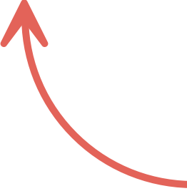
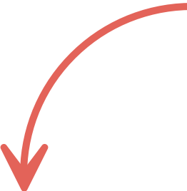

# The most powerful tactic? [Maximize]{.emphasis} the [data-pixel ratio]{.emphasis}! {background-color="var(--divider-bg)"}

## Maximize the [data-pixel ratio]{.emphasis}! {background-image="images/data-pixel-bg.jpg"}

::: {.body-light}
This concept was initially put forth by Edward Tufte as **"the data-ink ratio,"** and Stephen Few later modernized it as **"the data-pixel ratio."**
:::

::: {.slide-stack}
::: {.ratio-fraction}
::: {.numerator .fragment fragment-index=2}
Data-Information Pixels
:::
::: {.denominator .fragment fragment-index=1}
All Non-Background Pixels
:::
:::
:::
  
{.absolute .fragment fragment-index=1 top="67%" left="54%" width="5%"}
[Every pixel that is not simply the background color]{.ratio-annotation .absolute .fragment fragment-index=1 top="71%" left="60%"}

{.absolute .fragment fragment-index=2 top="31%" left="45%" width="5%"}
[Pixels that represent actual data or information]{.ratio-annotation .absolute .fragment fragment-index=2 top="26%" left="51%"}

::: {.notes}
(After build) This is an example of a slide with high cognitive load.

Call out: let's see what happens if we remove all of those non-data-information pixels!

Image source: https://unsplash.com/photos/candlestick-stock-chart-on-dark-screen-VLpWpv3oDB4
:::

## {.no-logo background-color="#0A0C0D"}

::: {.slide-stack}
::: {.ratio-fraction-lg}
::: {.numerator}
Data-Information Pixels
:::
::: {.denominator}
All Non-Background Pixels
:::
:::
:::
{.absolute top="63%" left="54%" width="5%"}
[Every pixel that is not simply the background color]{.ratio-annotation .absolute top="67%" left="60%"}

{.absolute top="22%" left="45%" width="5%"}
[Pixels that represent actual data or information]{.ratio-annotation .absolute top="17%" left="51%"}

::: {.notes}
We've drastically increased the data-pixel ratio, which gives the brain fewer choices to make as to what to try to take in and process.

When I removed all the extra clutter, I actually had more room on the slide, which then let me make the ratio itself larger on the screen.
:::