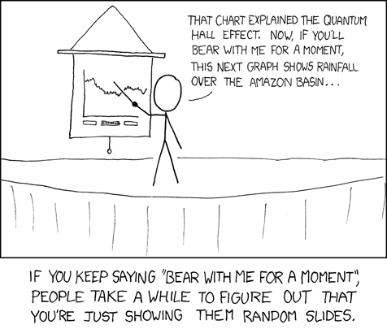

# Slides can help [keep the audience's attention]{.emphasis}! {background-color="var(--divider-bg)"}

## {.center background-image="images/pic_womans_portrait.jpg" background-size="auto 100%" background-position="right center"}

::: {.text-panel-left-60}
::: {.slide-body-heading}
Images can bring out [emotion]{.emphasis}.
:::
:::

::: {.notes}
Source: https://unsplash.com/photos/womans-portrait-mC852jACK1g
:::

## {.center background-image="images/pic_cold_shower.jpg" background-size="auto 100%" background-position="right center"}

::: {.text-panel-left-60}
::: {.slide-body-heading}
Images can bring out [emotion]{.emphasis}.
:::
:::

::: {.notes}
Source: https://unsplash.com/photos/topless-man-with-water-droplets-on-his-face-UFm4e4fsEZc
:::

## {.center background-image="images/pic_white_thunder.jpg" background-size="auto 100%" background-position="right center"}

::: {.text-panel-left-60}
::: {.slide-body-heading}
Images can bring out [emotion]{.emphasis}.
:::
:::

::: {.notes}
Source: https://unsplash.com/photos/selective-photography-of-white-thunder-nbqlWhOVu6k
:::

## {.center background-image="images/pic_person_standing.jpg" background-size="auto 100%" background-position="right center"}

::: {.text-panel-left-60}
::: {.slide-body-heading}
Images can bring out [emotion]{.emphasis}.
:::
:::

::: {.notes}
Source: https://unsplash.com/photos/person-standing-on-hill-EAvS-4KnGrk
:::

## {.center background-image="images/pic_sunrise.jpg" background-size="auto 100%" background-position="right center"}

::: {.text-panel-left-60}
::: {.slide-body-heading}
Images can bring out [emotion]{.emphasis}.
:::
:::

::: {.notes}
Source: https://unsplash.com/photos/brown-boat-near-dock-qkfxBc2NQ18
:::

## Slides can inject [levity]{.emphasis}.

::: {.rotate-ccw-15 style="position: absolute; top: 20%; left: 5%;"}

:::

::: {.rotate-cw-15 style="position: absolute; top: 25%; left: 35%;"}

:::

## But be careful!

xkcd example
GIFs (cat typing)

(Getting people to laugh)

Be careful with levity... Star Trek references won't land with everyone.

Callback...

::: {.notes}
xkcd Source: https://xkcd.com/365

## Draw Focus

Blank screen w/ a light bulb
OR
"Story time!"

