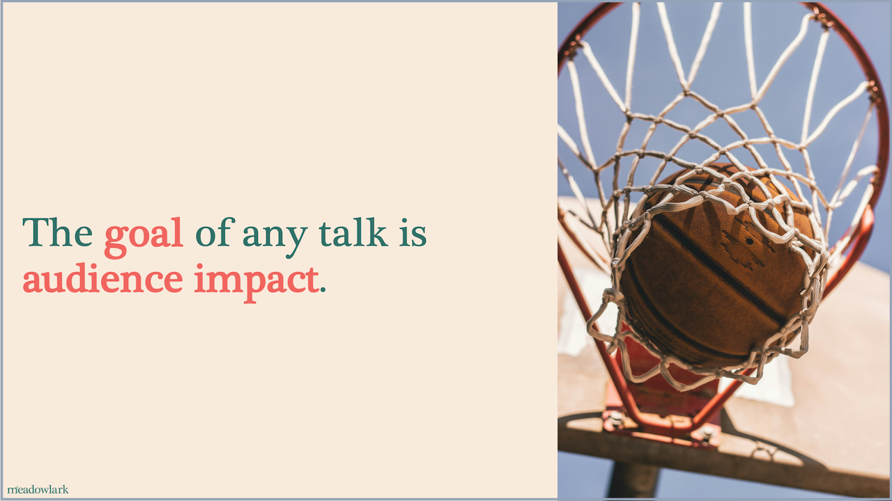
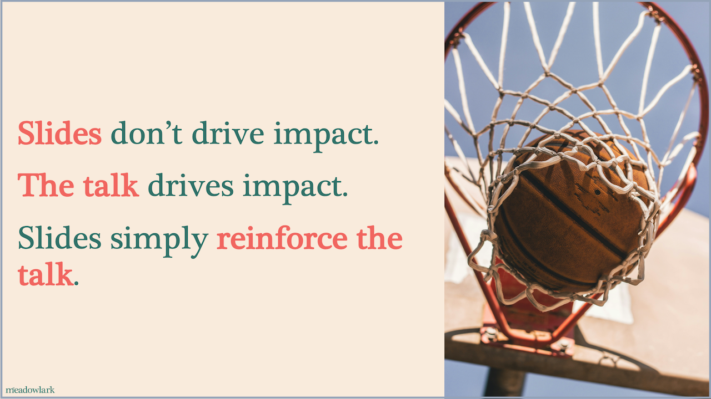
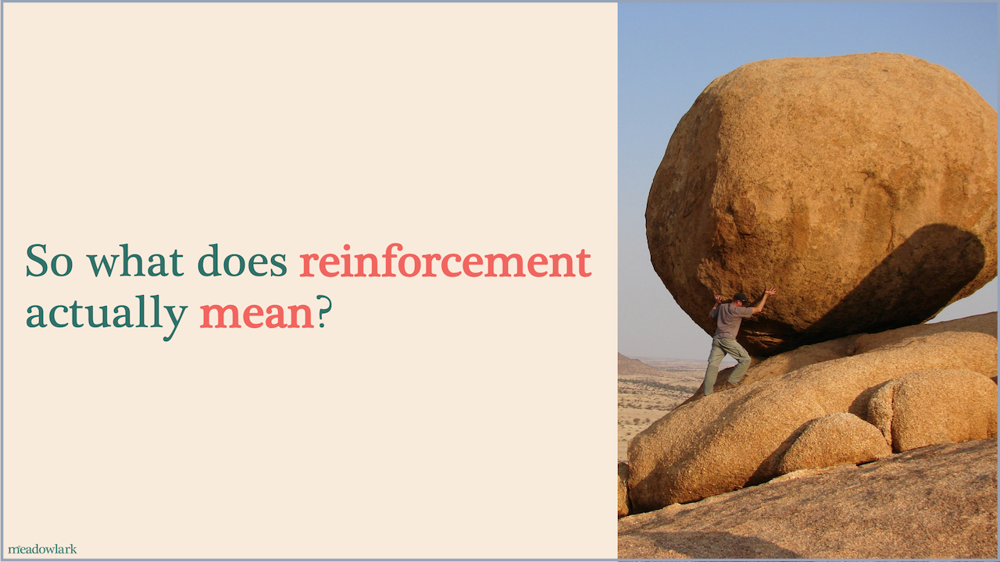
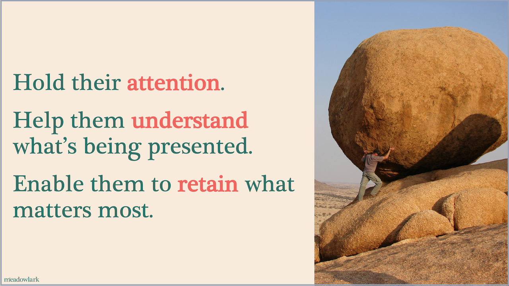

```{r palette-mckinsey-setup}

# Packages
if (!require("pacman")) install.packages("pacman")
pacman::p_load(tidyverse,
               scales)

# Brand palette
brand <- list(
  bg        = "#F9EBDC",
  primary   = "#317168",
  secondary = "#9D792F",
  accent    = "#F1655F",
  dark      = "#292F20",
  muted_med = "#5F6B71", # Darker than OG; safer that it will show up.
  muted     = "#94a3b8", # OG muted; concerned that it may be too light for projectors
  gratuitous = "#725496"  # deliberately off-brand, for the "before" examples
)

font_serif <- "Plantagenet Cherokee"
font_sans_serif <- "Halyard Text"

# Data set for line chart
df_psavert <- economics |>
  filter(date >= as.Date("2009-01-01"), date <= as.Date("2009-12-01"))

```

# Maximizing the Impact of<br>[Slide Titles]{.emphasis} {background-color="var(--divider-bg)"}

## McKinsey Titles
::: {.subtitle-slide-text}
Definition
:::

* The title of the slide is structured as a sentence

* That sentence has a single declarative takeaway

* The body of the slide then reinforces that single takeaway

## McKinsey titles are a [declarative statement]{.emphasis}!{background-image="images/pic_pointing_hand.jpg" background-size="100% auto" background-position="center bottom"}

::: {style="position: absolute; top: 35%; left: 60%; font-size: 2.5em; text-align: left; color: `r brand$bg`"}
One point,<br>clearly stated,<br>reinforced by the<br>body of the slide
:::

## McKinsey titles are a [declarative statement]{.emphasis}!{background-image="images/pic_pointing_hand.jpg" background-size="100% auto" background-position="center bottom"}
::: {.subtitle-slide-text}
Definition
:::

::: {style="position: absolute; top: 35%; left: 60%; font-size: 2.5em; text-align: left; color: `r brand$bg`"}
One point,<br>clearly stated,<br>reinforced by the<br>body of the slide
:::

## Stimulus payments in [May]{.emphasis} drove [savings spike]{.emphasis}{.nostretch auto-animate=true auto-animate-id="vert-logic" auto-animate-unmatched="false"}
::: {.subtitle-slide-text}
Personal saving rate by month: 2009
:::

::: {data-id="vert-arrow".mc-logic-vert style="top: -1110px;"}

:::

::: {data-id="vert-logic".mc-logic-vert style="top: -400px;"}
Vertical Logic
:::

```{r line-impossible}
#| fig.width: 8
#| fig.height: 4.2
#| fig-align: center
#| out.width: 77%

# Add the highlight spot
df_highlight <- df_psavert |> 
  filter(date == as.Date("2009-05-01")) |> 
  mutate(psavert_callout = "ARRA Payments")
 
gg_line_final <- ggplot(df_psavert, aes(x = date, y = psavert)) +
  geom_line(linewidth = 0.7, color=brand$primary) +
  # The highlighted point
  geom_point(
    data = df_highlight,
    aes(x = date, y = psavert),
    size = 3,
    color = brand$accent
  ) +
  # Left-pointing arrow, positioned to the right of the point
  geom_segment(
    data = df_highlight,
    aes(x = date + 25, xend = date + 6,
        y = psavert, yend = psavert),
    arrow = arrow(length = unit(0.15, "cm"), type = "closed"),
    linewidth = 0.6,
    color = "gray30",
    inherit.aes = FALSE
  ) +
  # Callout text at the tail end of the arrow
  geom_label(
    data = df_highlight,
    aes(x = date + 28, y = psavert, label = psavert_callout),
    hjust = 0,
    vjust = 0.5,
    size = 5,
    family = font_sans_serif,
    color = "gray20", 
    fill = brand$bg,
    label.size = 0
  ) +
  scale_x_date(date_labels = "%b", date_breaks = "1 month") +
  scale_y_continuous(
    labels = label_percent(scale = 1),
    breaks = seq(0, 8, by = 2),
    expand = c(0,0),
    limits = function(x) c(0, ceiling(max(x)))
   ) +
  theme_minimal() +
  theme(
    plot.title.position = "plot",
    plot.background = element_rect(fill = brand$bg, color = NA),
    axis.title = element_blank(),
    panel.grid.major.x = element_blank(),
    panel.grid.major.y = element_line(color = "gray70", linewidth = 0.2),
    axis.text = element_text(family = font_sans_serif, size = 12, color = "gray60"),
    axis.line.x = element_line(color = "gray40", linewidth = 0.4)
  )

gg_line_final
```

::: {.slide-source-footer .muted}
[Source: https://fred.stlouisfed.org/series/PSAVERT/]{.muted}
:::

## Stimulus payments in [May]{.emphasis} drove [savings spike]{.emphasis}{.nostretch auto-animate=true auto-animate-id="vert-logic" auto-animate-unmatched="false"}
::: {.subtitle-slide-text}
Personal saving rate by month: 2009
:::

::: {data-id="vert-arrow".mc-logic-vert style="top: 110px;"}

:::

::: {data-id="vert-logic".mc-logic-vert style="top: 800px;"}
Vertical Logic
:::

```{r line-impossible-2}
#| fig.width: 8
#| fig.height: 4.2
#| fig-align: center
#| out.width: 77%

gg_line_final
```

::: {.slide-source-footer .muted}
[Source: https://fred.stlouisfed.org/series/PSAVERT/]{.muted}
:::

## McKinsey titles can [“tell the story”]{.emphasis} concisely{auto-animate=true auto-animate-id="horiz-logic" auto-animate-unmatched="false"}

{.absolute top=200 left=50 width="450" z-index="5" data-id="mc-horiz-1"}
{.absolute top=400 left=390 width="450" z-index="10" data-id="mc-horiz-2"}
{.absolute top=200 left=730 width="450" z-index="15" data-id="mc-horiz-3"}
{.absolute top=400 left=1070 width="450" z-index="20" data-id="mc-horiz-4"}
{.absolute top=200 left=1410 width="450" z-index="25" data-id="mc-horiz-5"}


::: {data-id="horiz-logic".mc-logic-horiz style="top: 700px; left: -700px;"}
Horizontal Logic
:::

::: {data-id="horiz-arrow".mc-logic-horiz style="top: 750px; left: -1500px;"}

:::

## McKinsey titles can [“tell the story”]{.emphasis} concisely{auto-animate=true auto-animate-id="horiz-logic" auto-animate-unmatched="false"}

{.absolute top=200 left=50 width="450" z-index="5" data-id="mc-horiz-1"}
{.absolute top=400 left=390 width="450" z-index="10" data-id="mc-horiz-2"}
{.absolute top=200 left=730 width="450" z-index="15" data-id="mc-horiz-3"}
{.absolute top=400 left=1070 width="450" z-index="20" data-id="mc-horiz-4"}
{.absolute top=200 left=1410 width="450" z-index="25" data-id="mc-horiz-5"}


::: {data-id="horiz-logic".mc-logic-horiz style="top: 700px; width: 100%; text-align: center;"}
Horizontal Logic
:::

::: {data-id="horiz-arrow".mc-logic-horiz style="top: 750px; left: 275px;"}

:::

# McKinsey Titles Can<br>[Reinforce the Narrative]{.emphasis} {background-color="var(--divider-bg)"}
